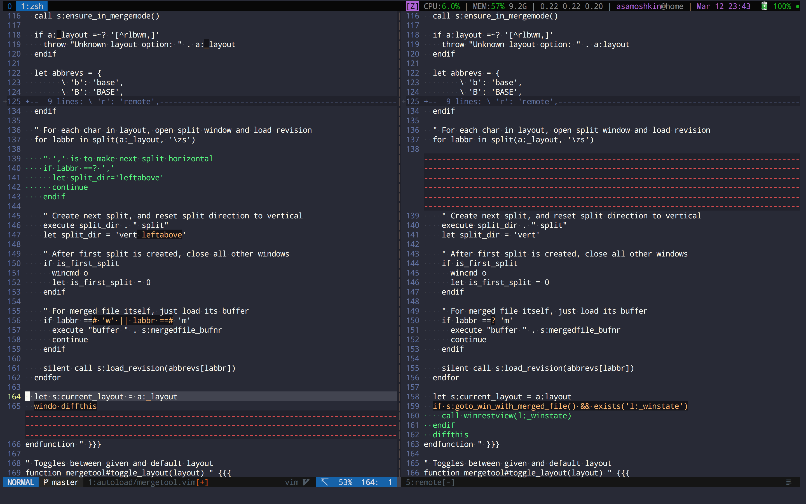
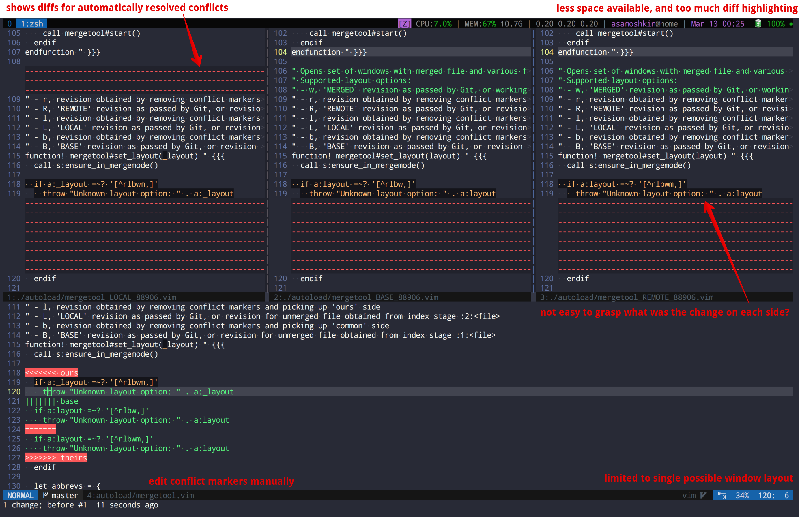
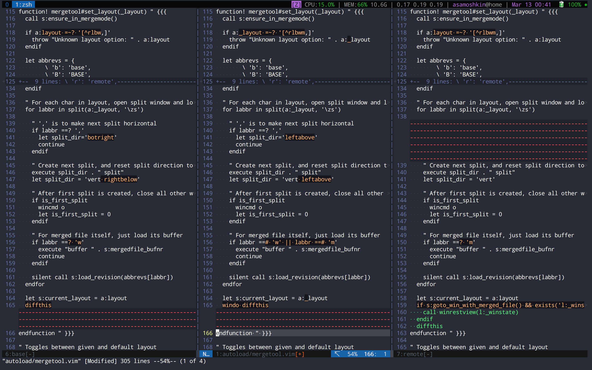
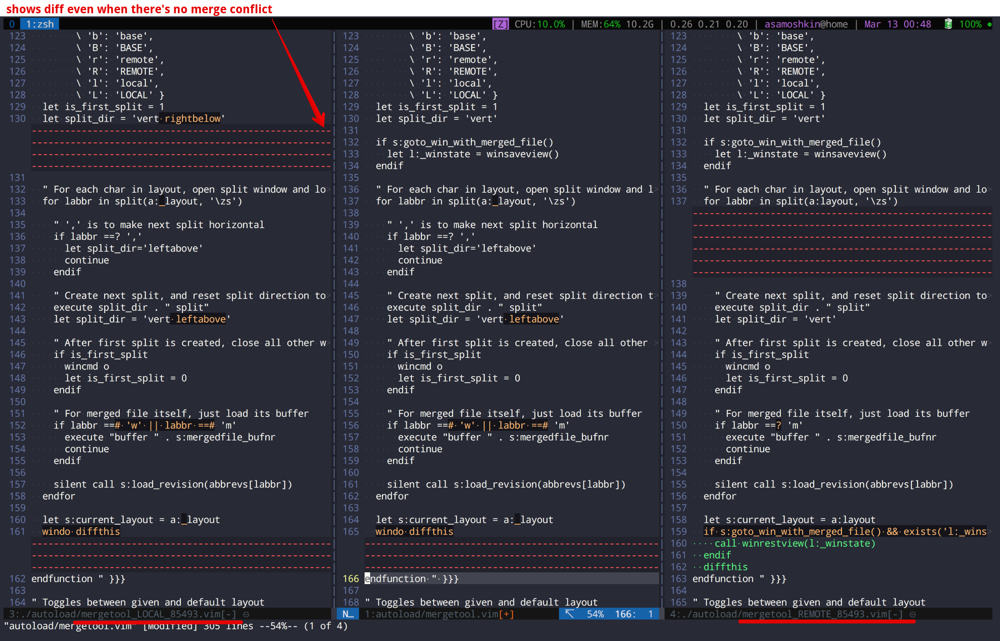
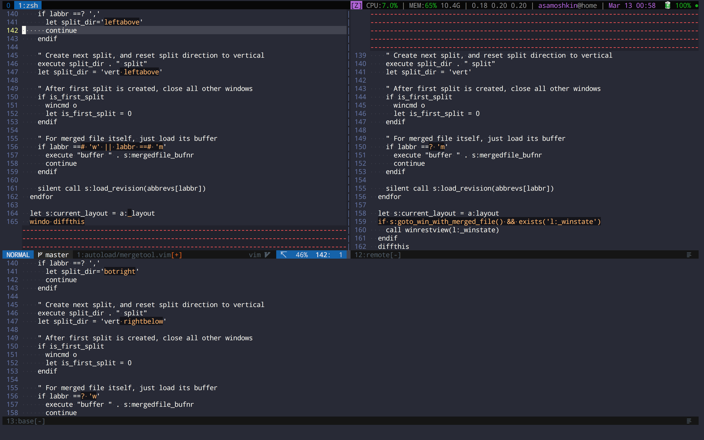
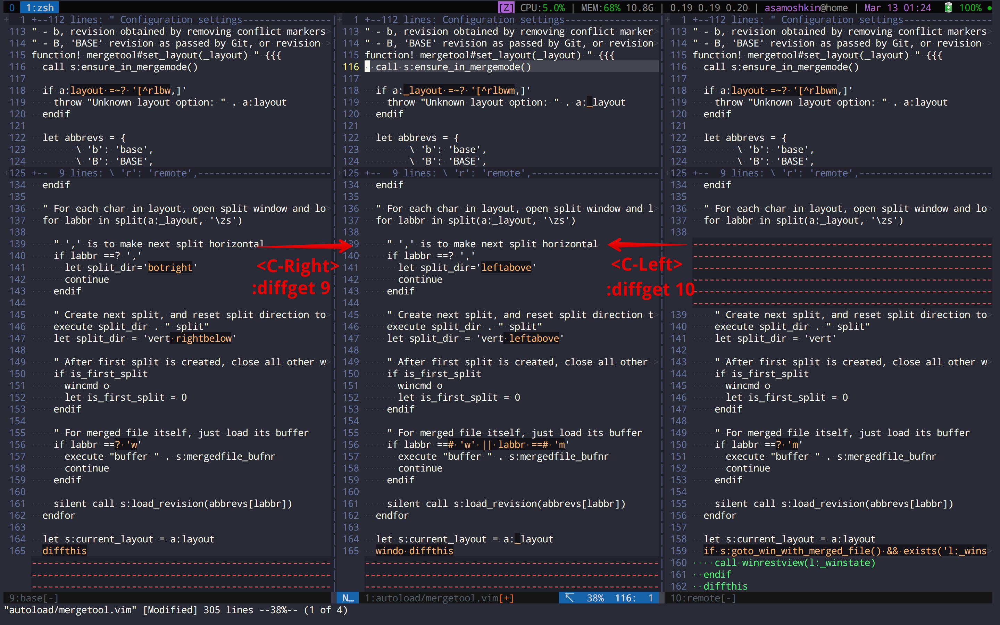
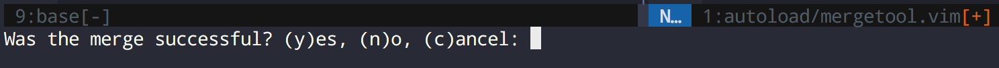

# vim-mergetool

Efficient way of using Vim as a Git mergetool. :cake: With `vim-mergetool` you can have your cake and eat it too.

## Overview

`vim-mergetool` processes `MERGED` file and extracts `ours`, `theirs`, or `common` sides of a conflict by parsing conflict markers left by Git. Then it shows 2-way diff between `ours` and `theirs` versions, with raw conflict markers being already removed.

Unlike simply comparing between `LOCAL` and `REMOTE` history revisions, it takes over where automatic Git merge algorithm gives up. Diffs are present only where Git cannot automatically resolve conflicts, and you're not distracted with diff highlighting of already resolved hunks.

In a screenshot below, `MERGED` file is on the left with conflict markers already removed with optimistic assumption of picking up changes from `ours` side. Then it's compared to the `REMOTE` branch, but focusing only on conflicts - not all the diffs. Yes, all diff highlighting you're seeing in a screenshot below - are actually merge conflicts.



Plus, to resolve the conflict you don't need to edit conflict markers directly - just pick either side of a conflict using `:diffget` and `:diffput` commands.

So far, it's similar to what [whiteinge/diffconflicts](https://github.com/whiteinge/diffconflicts) already does. But that's only the beginning...

**Features**:
- Flexible layouts. You're not limited to default 2-way diff layout. You can use 3-way diff layout, or even setup window of 4 splits. Both horizontal and vertical splits are supported, and mix thereof.
- Toggle between layouts during merge. You can have several layouts and toggle between them during merge. For example, you're using 2-way diff by default, but sometimes you want to quickly recall what's the state of a diff in the `BASE` revision, but don't want to keep 3rd `BASE` split constantly opened.
- Choose preferred conflict side. You can choose `ours`, `theirs` or `base` side of a conflict for `MERGED` file as a default, or work with raw conflict markers.
- Conventional `LOCAL`, `REMOTE`, `BASE` history revisions are available to compare to as well.
- Can be run as a `git mergetool`, or by opening a file with conflict markers from the running Vim instance.
- Prompts whether merge was successful on quit. If not, rollbacks changes and report non-zero exit status code when run as a `git mergetool`.
- Smart diff exchange commands. Tell direction of a window to `diffget` or `diffput` instead of specifying a buffer number. Especially handy for 3-way diffs. Not limited to merge conflict scenarios, can be used for regular diffs.
- Can tell if we're in merge mode right now. Useful for showing some sort of indicator in a status line.


## Why do I need it?
Most merge tools use 3-way diff approach by showing several split windows, that include `LOCAL` revision (current branch), `REMOTE` revision (branch we're going to merge), `BASE` revision (common base ancestor), and working tree version of `MERGED` file with or without conflict markers.

Here is the same merge scenario opened with a default `vimdiff` as a mergetool:


While 3-way diff paradigm is superior to 2-way diff for merging purposes, it does not fit Vim well:

**Disadvantages**:
- When several revisions are compared at the same time (i.e `:diffthis` in all buffers), Vim highlights every diff between each of those files. Usually that means every possible change between BASE-LOCAL-REMOTE-MERGED files, including those which are not relevant to conflict resolution.
- It highlights even those hunks, which were already automatically resolved by `git merge-file`. It distracts you from focusing purely on unresolved conflicts. Indeed, I don't want to care about already resolved conflicts.
- Limited window width when three vertical splits are opened. Forces you to scroll horizontally, or wrap lines. Unless you have enough screen width, it's difficult to quickly grasp changes when window width is only ~50 columns or so. Usually, it's not easy to tweak predefined layout.
- Forces you to pick up conflict side by directly editing conflict markers, instead of choosing change from the left or the right.
- `:diffget` and `:diffput` Vim commands are convenient only when there're two split windows, otherwise they become ambiguous and you need to tell them the target buffer number, which is a real showstopper. No one wants to think on "What's the Vim's buffer number of the window on the right/left?", when you're already pulling your hair trying to resolve conflicts from long running "feature" branch.

## Alternative solutions

- default `vimdiff` merge tool. Shows layout with 3 vertical splits: `LOCAL`, `REMOTE`, `BASE` revisions, and the horizontal split at the bottom with a `MERGED` file, containing raw conflict markers.
- [vim-fugitive](https://github.com/tpope/vim-fugitive) `:Gdiff` command, which automatically detects conflict markers in a file and switches into 3-way diff. Shows 3 vertical splits: `LOCAL`, `REMOTE` revisions and `MERGED` file in the middle with raw conflict markers. See this [reddit comment](https://www.reddit.com/r/vim/comments/b0jjgw/github_samoshkinvimmergetool_efficient_way_of/eif6oio/) on difference between [vim-figutive] and this plugin.
- [whiteinge/diffconflicts](https://github.com/whiteinge/diffconflicts). Parses `MERGED` file and removes conflict markers to pick up one side of a conflict. Default to 2-split layout with `local` and `remote` revisions.
- Drop using Vim as a mergetool. Use some GUI program, like [DiffMerge](https://sourcegear.com/diffmerge/) or [Kdiff3](http://kdiff3.sourceforge.net/). Better to use both though.


## Installation

Use your favorite Vim plugin manager.

Minimal working configuration using [vim-plug](https://github.com/junegunn/vim-plug).

```vim
set nocompatible
filetype plugin indent on

call plug#begin('~/.vim/plugged')
  Plug 'samoshkin/vim-mergetool'
call plug#end()

let g:mergetool_layout = 'mr'
let g:mergetool_prefer_revision = 'local'
```

## Features

**NOTE**: `vim-mergetool` does not set up any key mappings for you. It justs exports a handful of commands and `<plug>` mappings. You're free to setup key mappings in your `vimrc` as you'd like.

### Preferred conflict side
`vim-mergetool` removes conflict markers from `MERGED` file, and picks up `ours/local` side of a conflict by default. If you prefer another side of a conflict:

```vim
" possible values: 'local' (default), 'remote', 'base'
let g:mergetool_prefer_revision = 'remote'
```

If you don't want `vim-mergetool` to process `MERGED` file and remove raw conflict markers:

```vim
let g:mergetool_prefer_revision = 'unmodified'
```

Alternatively, you can start with `local` or `unmodified` revision, and change your mind later during merge process by running one of these commands:

```vim
:MergetoolPreferLocal
:MergetoolPreferRemote
```

### Available revisions to compare

2-way diff between `local` and `remote` versions derived from conflict markers is a sane default, but you might want to compare `MERGED` file against other revisions:
- `LOCAL`, current branch HEAD.
- `REMOTE`, HEAD of the branch we're going to merge
- `BASE`, common ancestor of two branches, i.e `git merge-base branchX branchY`
- `local`, `remote`, `base` (in lowercase), those are revisions derived from `MERGED` file by picking up either side of a conflict from conflict markers


### Layout

`vim-mergetool` defaults to two vertical splits layout with `MERGED` file on the left, and `remote` revision on the right. `MERGED` file is processed according to `g:mergetool_prefer_revision` setting as described above.

```vim
" (m) - for working tree version of MERGED file
" (r) - for 'remote' revision
let g:mergetool_layout = 'mr'
```

If you want to use 3-way diff layout as a default, with a `base` revision in the leftmost split:

```vim
let g:mergetool_layout = 'bmr'
```



To show usual `REMOTE`, `LOCAL`, `BASE` history revisions, use uppercase characters:

```vim
let g:mergetool_layout = 'LmR'
```

Here you can spot the difference comparing against LOCAL/REMOTE branch tips versus picking up `ours` or `theirs` revision based on conflict markers in a `MERGED` file. You're getting diff highlighting even when there is no merge conflicts.

By the way, this setup is pretty much same to what [vim-fugitive](https://github.com/tpope/vim-fugitive) `:Gdiff` does, except that conflict markers are already removed. You can use `g:mergetool_prefer_revision='unmodified'` to replicate vim-fugitive completely. Indeed, `vim-mergetool` is flexible enough to replicate any existing vim+merge solution.



By default vertical splits are used. If you prefer working with horizontal splits:

```vim
let g:mergetool_layout = 'm,r'
```

You can mix both approaches. For example, show `MERGED` file and `remote` revision in vertical splits as usual, and have horizontal split with `base` revision at the bottom.

```vim
let g:mergetool_layout = 'mr,b'
```




### Toggle layout during merge
You are not limited to single possible layout. You can switch easily between different layouts during merge process.

For example, you can start with 2-way diff layout, and then temporarily toggle additional split with `base` revision on the left or at the bottom. Or hide `MERGED` file altogether and review `LOCAL`, `BASE` and `REMOTE` history revisions.


```vim
" In 'vimrc'
" Default layout
let g:mergetool_layout = 'mr'

" Later, during merge process:

" View 'base' revision on the left
:MergetoolToggleLayout bmr

" View 'base' revision in horizontal split at the bottom
:MergetoolToggleLayout mr,b

" View history revisions, and hide 'MERGED' file altogether
:MergetoolToggleLayout LBR
```


In addition to commands, you can setup key mappings for your most common layouts:

```vim
nnoremap <silent> <leader>mb :call mergetool#toggle_layout('mr,b')<CR>
```

### Running as a `git mergetool`

`vim-mergetool` can be configured to run as a `git mergetool`. In your `~/.gitconfig`:

```ini
[merge]
tool = vim_mergetool
conflictstyle = diff3

[mergetool "vim_mergetool"]
cmd = vim -f -c "MergetoolStart" "$MERGED" "$BASE" "$LOCAL" "$REMOTE"
trustExitCode = true
```

Git detects whether merge was successful or not in two ways:
- When `trustExitCode = false`, checks if `MERGED` file was modified.
- When `trustExitCode = true`, checks exit code of a merge tool process.

`vim-mergetool` supports both options. On quit, if merge was unsuccessful,  it both discards any unsaved changes to buffer without touching file's `ctime` and returns non-zero exit code.


### Running directly from running Vim instance
You can enter and exit merge mode from running Vim instance by opening a file with conflict markers, and running one of the commands:

```vim
:MergetoolStart
:MergetoolStop
:MergetoolToggle
```

You can setup a key mapping to toggle merge mode:

```vim
nmap <leader>mt <plug>(MergetoolToggle)
```

Upon entering merge mode, `vim-mergetool` would switch to a new tab, to avoid breaking your current window layout.

When exiting merge mode, if merge was unsuccessful, `vim-mergetool` would discard changes to merged file and rollback to a buffer state as it were right before starting a merge.

Unlike running as a `git mergetool`, `LOCAL`, `REMOTE` and `BASE` history revisions are not passed from the outside. In this mode, `vim-mergetool` extracts them from the numbered stages of Git index.

```bash
$ git cat-file -p :1:{file} > {file}.base
$ git cat-file -p :2:{file} > {file}.local
$ git cat-file -p :3:{file} > {file}.remote
```

**NOTE:** Therefore, It's assumed that Git merge is in progress, and `cwd` of running Vim instance is set to repository root dir.


### Smart diff exchange commands

Vim's `:diffget` and `:diffput` commands are convenient and unambiguous as soon as you have only two buffers in diff mode. If you prefer 3-way diff, you're out of lucky, as you need to explicitly tell the buffer number you want to exchange diff with.

`vim-mergetool` comes with `DiffExchange` commands and mapping, that accepts direction of a diff movement: "left", "right", "up", "down". You can setup your own key mappings for diff mode only:

```vim
nmap <expr> <C-Left> &diff? '<Plug>(MergetoolDiffExchangeLeft)' : '<C-Left>'
nmap <expr> <C-Right> &diff? '<Plug>(MergetoolDiffExchangeRight)' : '<C-Right>'
nmap <expr> <C-Down> &diff? '<Plug>(MergetoolDiffExchangeDown)' : '<C-Down>'
nmap <expr> <C-Up> &diff? '<Plug>(MergetoolDiffExchangeUp)' : '<C-Up>'
```

Commands are available as well:

```vim
:MergetoolDiffExchangeLeft
:MergetoolDiffExchangeRight
:MergetoolDiffExchangeDown
:MergetoolDiffExchangeUp
```

`DiffExchange` logic runs either `:diffget` or `:diffput` with a right buffer number of adjacent window, depending on:
- given direction
- whether window in opposite direction exists or not



It's easier to explain with example.

Suppose, you have 3 split layout: `MERGED` file in the middle, `base` and `remote` revisions are on the sides. Typically, the middle one with a `MERGED` file is an active split. You navigate from hunk to hunk, and decide what to do with a conflict: leave as is, or pick version from left/right splits.
- `<C-Left>` would `diffget` change from the right split into the middle one. If you imagine the diff movement - it goes from right to the left.
- `<C-Right>` would `diffget` change from the left split into the middle one. If you imagine the diff movement - it goes from left to the right.

If the rightmost split were the active one:
- `<C-Left>` would `diffput` change from the current split into the middle one. As soon as there is no adjacent window on the right to get change from, we invert `diffget` operation into `diffput`.
- `<C-Right>` would `diffget` change from middle split.

Same logic applies to "up" and "down" directions. Useful if you prefer horizontal splits.

**Conclusion**: despite how many splits are opened and what's the layout, you don't need to wrap your head around `diffput` vs `diffget` semantics, and you don't need to figure out correct buffer numbers manually. You just tell desired diff movement direction, and `vim-mergetool` handles the details for you.

**Limitation**: `DiffExchange` commands work only in normal mode, and do not support visual mode and working with line ranges.

`DiffExchange` functionality is not specific to resolving merge conflicts, and can be used for regular diffs.

If you like `<C-arrow>` mappings from the snippet above, you might also want to map `<up>` and `<down>` keys to navigate diffs, instead of default `[c` and `]c` mappings. They're not used anyway, since you're using `h,j,k,l` for movements, are you? ;-)

```vim
nmap <expr> <Up> &diff ? '[c' : '<Up>'
nmap <expr> <Down> &diff ? ']c' : '<Down>'
```


### Merge mode detection
You can detect whether you're in merge mode now, by inspecting `g:mergetool_in_merge_mode` variable.

It can be helpful to show indicator in a status line. Example for [vim-airline](https://github.com/vim-airline/vim-airline):

```vim
function! AirlineDiffmergePart()
  if get(g:, 'mergetool_in_merge_mode', 0)
    return '↸'
  endif

  if &diff
    return '↹'
  endif

  return ''
endfunction

call airline#parts#define_function('_diffmerge', 'AirlineDiffmergePart')
call airline#parts#define_accent('_diffmerge', 'bold')

let g:airline_section_z = airline#section#create(['_diffmerge', ...other_parts])
```


### Quitting merge mode

When exiting merge mode, `vim-mergetool` would prompt you whether merge was successful. If not, it will rollback changes to the buffer, will not save `MERGED` file to disk, and exit with non-zero code, when running as a `git mergetool`.



You can either issue `:MergetoolStop` or `:MergetoolToggle` commands, or use dedicated mapping.

Yet another approach, which I prefer in my personal `vimrc`, is having a `<leader>q` key mapped to context-aware `QuitWindow()` function. It detects whether we're in merge mode, and runs `:MergetoolStop` command, or just uses normal "quit" command otherwise.

```vim
function s:QuitWindow()

  " If we're in merge mode, exit
  if get(g:, 'mergetool_in_merge_mode', 0)
    call mergetool#stop()
    return
  endif

  if &diff
    " Quit diff mode intelligently...
  endif

  quit
endfunction

command QuitWindow call s:QuitWindow()
nnoremap <silent> <leader>q :QuitWindow<CR>
```


## Assumptions
**[AS1]**: Standard conflict markers include only `ours` and `theirs` version (default conflict style called "merge"). `vim-mergetool` expects conflict markers to include `common` base ancestor version as well:

```
" <<<<<<< HEAD
" ours/local revision
" ||||||| base
" common base revision
" =======
" theirs/remote revision
" >>>>>>> feature
```

Put following in your `~/.gitconfig` to use [diff3](https://git-scm.com/docs/git-config#Documentation/git-config.txt-mergeconflictStyle) conflict style as a default:

```ini
[merge]
conflictStyle = diff3
```

**[AS2]**: When using `vim-mergetool` from a running Vim instance, as opposite to running as a `git-mergetool`, it's assumed that `cwd` of running Vim instance is set to repository root dir, and that Git merge is in progress.

## Credits
Was inspired by [whiteinge/diffconflicts](https://github.com/whiteinge/diffconflicts).
